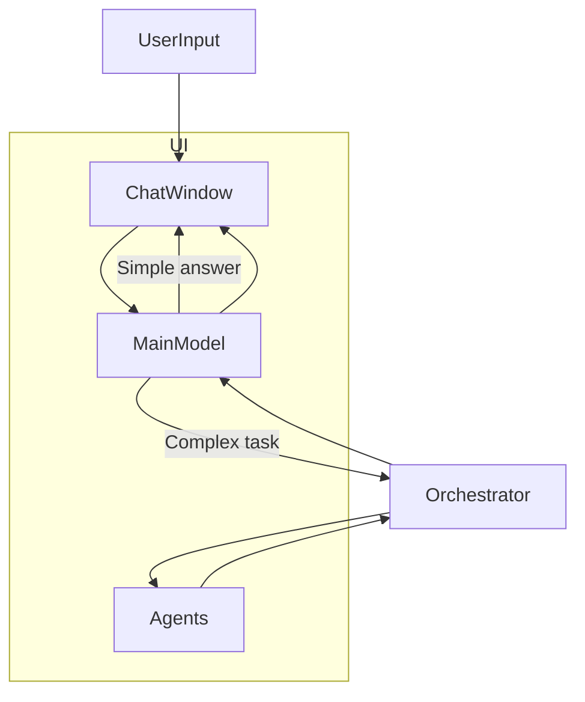

# Immersive Chat-Driven Developer Experience Plan

---

## Vision

Create an engaging, pixel-art, chat-driven UI that visualizes the autonomous multi-agent system in real time, enabling intuitive interaction, monitoring, and control of complex workflows.

This immersive UI is a core part of **Digital Double Virtual Workforce 3.5**, complementing its multi-agent orchestration, adaptive learning, plugin integration, and self-healing capabilities.

---

## Key Components

### 1. Pixel-Art UI & Avatars
- Pixelated avatars represent specialized agents (planner, researcher, coder, messenger, execution, creative, file).
- Avatars animate to reflect agent states (idle, working, researching, error).
- Visualize agent collaboration and task flow.

### 2. Chat Interface
- Central chat window for user input and agent responses.
- Supports natural language commands and feedback.
- Displays real-time updates from agents.

### 3. Real-Time Collaboration Visualization
- Animate agent interactions, task assignments, and progress.
- Show message flows and data exchanges.
- Reflect backend orchestration in real time via WebSockets.

### 4. Backend Orchestration Integration
- Connects to multi-agent orchestrator via REST API and WebSockets.
- Visualizes autonomous task planning, execution, and adaptation.
- Displays plugin adapter activities and system control events.

### 5. Drag-and-Drop Workflow Editor (Planned)
- Visual builder for creating and modifying workflows.
- Connect tasks, agents, and plugins visually.
- Save, load, and execute workflows seamlessly.

---

## Architecture Overview

---

## Implementation Steps

1. **Design pixel-art avatars** for each agent role and state.
2. **Develop chat interface** connected to backend APIs.
3. **Animate agent collaboration** based on real-time events.
4. **Integrate backend orchestration** for live updates.
5. **Add persona prompt generation** in main model.
6. **Develop drag-and-drop workflow editor.**
7. **Test and refine** immersive experience.

---

## Alignment with Platform

- Visualizes the autonomous, adaptive, multi-agent system.
- Enhances transparency and control for users.
- Supports real-time monitoring and debugging.
- Integrates seamlessly with plugin adapters and self-healing.
- Provides an intuitive interface for complex automation.

---

## Summary

This immersive, pixel-art, chat-driven UI transforms the Digital Double Virtual Workforce 3.5 into an engaging, transparent, and controllable autonomous AI platform, empowering users to interact with and oversee complex multi-agent workflows effortlessly.

---