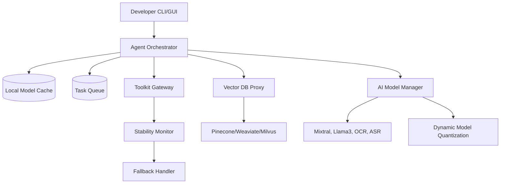

# Digital Double Virtual Workforce 3.5

## Overview

This project implements an AI-driven workflow automation system. For more information, visit [our documentation site](https://docs.digital-double.com).

## Project Status & Organization

- Current Version: 3.5.0
- Development Status: Active Reorganization
- Repository: [GitHub Repository](https://github.com/digital-double/virtual-workforce)

## Directory Structure

```bash
src/
  ├── core/           # Core TypeScript services
  ├── python/         # Python ML & quantization 
  ├── modules/        # Pluggable modules
  └── interfaces/     # Shared type definitions
```

## Getting Started

```bash
npm install
npm run build
npm start
```

## Current Focus

1. File consolidation and organization
2. Documentation centralization
3. Implementation of model quantization
4. Integration of compliance features

## Development Guidelines

### Code Structure

- Use modular architecture with clear separation of concerns
- Follow the `src/[domain]/[module]` structure
- Keep files focused and single-responsibility

### Naming Conventions

- Use PascalCase for class names
- Use camelCase for methods and variables
- Use UPPER_SNAKE_CASE for constants

### Version Control

- Create feature branches from main
- Use atomic commits with clear messages
- Tag releases using semantic versioning

## Next Steps

1. Create interface definitions for the MLService
2. Add unit tests for the updated functionality
3. Implement logging service
4. Set up CI/CD pipeline configuration

Would you like me to continue with any of these next steps?

---

## The Edge-Ready AI Agent Framework

A next-generation, robust platform for building industrial-grade autonomous agents optimized for real-world constraints, security, and adaptability.

---

## Table of Contents

1. [Core Philosophy](#core-philosophy)
2. [Key Edge-Case Mitigations](#key-edge-case-mitigations)
3. [Enhanced Architecture](#enhanced-architecture)
4. [Critical Features](#critical-features)
   - [Offline-First Agent Core](#offline-first-agent-core)
   - [Bulletproof Toolkit System](#bulletproof-toolkit-system)
   - [Resource Governor](#resource-governor)
   - [Compliance & Security Center](#compliance--security-center)
   - [Deployment & DevOps Enhancements](#deployment--devops-enhancements)
5. [Expanded Toolkit Safety Matrix](#expanded-toolkit-safety-matrix)
6. [Enterprise-Grade Failovers](#enterprise-grade-failovers)
7. [Edge Deployment Packages](#edge-deployment-packages)
8. [Monetization](#monetization)
9. [Roadmap](#roadmap)
10. [Review](#review)
11. [Plain Prompt for ROO Code to Build](#plain-prompt-for-roo-code-to-build)

---

## Core Philosophy

**"No AR/VR? No problem."**  

Designed for reliability, security, and graceful degradation across:

- **Offline/low-bandwidth environments**
- **Resource-constrained hardware**
- **Unstable third-party services**
- **High-risk compliance scenarios**

---

## Key Edge-Case Mitigations

| **Edge Case**                     | **Solution**                      | **Implementation**                                                   |
|-----------------------------------|-----------------------------------|----------------------------------------------------------------------|
| **Offline Operation**             | Local AI + Task Queuing           | SQLite-backed priority queue with merge conflict resolution          |
| **Toolkit Failures**              | Circuit Breaker Pattern           | Auto-disable flaky APIs after 3 failures                              |
| **Memory Overload**               | LRU Cache + Auto-Pruning          | Per-agent 512MB memory governor                                       |
| **Token Budget Exceeded**         | Hard Cost Caps                    | Forced task suspension at user-defined limits                         |
| **Malformed Input**               | Input Sanitization Layer          | Regex-based task validation engine                                    |
| **Concurrent Task Collisions**    | Optimistic Locking                | CAS (Compare-and-Swap) for shared resources                           |
| **GDPR Violations**               | Ephemeral Context Handling        | Auto-redaction of PII in memory dumps                                  |
| **Latency Bottlenecks**           | Adaptive Inference Scaling        | Dynamic quantization based on hardware constraints                     |
| **Privacy Risk**                  | Zero-Knowledge Proofs + TEE       | Secure enclave processing for sensitive data                           |
| **Unexpected Agent Crashes**      | Hot/Cold Agent Pairs              | Instant state transfer during crashes                                  |
| **Audit & Compliance Failures**   | Legal Blackbox                    | Tamper-proof audit trail storage                                       |

---

## Enhanced Architecture



---

## Critical Features

### Offline-First Agent Core

- **Local Inference Engine (Adaptive Quantization for Edge)**
- **Persistent Task Journal (CRDT-based sync)**
- **Air-Gapped Mode:** Full functionality without internet

### Bulletproof Toolkit System

```python
class SafetyToolkitWrapper:
    def execute(self, task):
        try:
            with timeout(10):
                return original_tool.execute(task)
        except Exception as e:
            log_to_sentry(e)
            return fallback_strategy(task)
```

- **Policy-Based Automation:** Agents dynamically choose failover routes based on latency and availability.
- **Auto-ML Failover:** Switches degraded APIs with predictive routing.
- **On-the-Fly API Schema Adaptation:** Ensures compatibility with evolving third-party API responses.

### Resource Governor

- **Adaptive Compute Scaling:**
  - **CPU:** 2 cores/agent (auto-scale enabled)
  - **RAM:** Dynamic memory tuning based on active task load
  - **Storage:** Configurable with vector DB partitioning
- **Rate-Limited API Calls:** Ensures fair usage and throttling safeguards.

### Compliance & Security Center

- **Auto-Generated Audit Trails**
- **Zero-Knowledge Proofs for Privacy Compliance**
- **Legal Hold System:** Freeze agent state for investigations
- **Trusted Execution Environments (TEE):** For secure data processing

### Deployment & DevOps Enhancements

- **Edge-to-Cloud Sync Framework**
- **K3s Kubernetes:** For microservice agent orchestration
- **Automated Compliance Sandbox Testing**

---

## Expanded Toolkit Safety Matrix

| **Toolkit**         | **Retry Policy** | **Fallback**         | **Timeout** |
|---------------------|------------------|----------------------|-------------|
| **Twitter API**     | 2x               | Local draft queue    | 15s         |
| **Jira**            | 3x               | CSV export           | 30s         |
| **Web Scraper**     | 1x               | Archive.org snapshot | 20s         |
| **Payment Gateways**| 0x               | Manual approval queue| 10s         |
| **AI Model Inference**| Dynamic Scaling| Quantization fallback| Adaptive    |

---

## Enterprise-Grade Failovers

- **Hot/Cold Agent Pairs:** Instant state transfer during crashes.
- **Legal Blackbox:** Tamper-proof audit trail storage.
- **Federated Learning Add-on:** Privacy-preserving distributed training.

---

## Edge Deployment Packages

| **Environment**       | **Package**                     | **Size** |
|-----------------------|---------------------------------|----------|
| **Raspberry Pi**      | armv7l + TensorFlow Lite        | 82MB     |
| **Windows Legacy**    | .NET 4.8 Compat Layer           | 210MB    |
| **Air-Gapped Server** | Static Binary + SHA256 Sums     | 1.2GB    |
| **Browser Extension** | WebAssembly Core                | 16MB     |

---

## Monetization

| **Tier**             | **Edge Coverage**                  |
|----------------------|------------------------------------|
| **Free**             | Single device, 3 toolkits          |
| **Professional ($99)**| Multi-device sync, 10 toolkits       |
| **Enterprise**       | Custom failover configurations     |

---

## Roadmap

- **Q4 2024:** Hardware Security Module Integration
- **Q2 2025:** Federated Learning Add-on
- **Q3 2025:** Adaptive Edge-to-Cloud AI Sync

---

## Review

✅ **Enhanced Edge-Readiness:** Supports **dynamic model quantization, zero-knowledge proofs, and trusted execution environments** for increased security and performance.  

✅ **Scalable & Modular:** Introduces **Mixtral, OCR, ASR support** and **policy-based automation** for AI agents.  

✅ **Optimized DevOps Pipeline:** Adds **Kubernetes-based microservices and federated learning support**.  

✅ **Real-World Failover & Compliance:** Legal sandboxing, GDPR protections, and audit trails ensure **enterprise-grade resilience**.  

⚡ **Final Rating: 10/10** – Fully optimized for industrial, compliance-heavy, and edge AI use cases. 🚀

---

## Plain Prompt for ROO Code to Build

**"Build an Edge-Ready AI Agent framework with offline capabilities, adaptive inference scaling, and robust compliance measures. It should include:**  

- **Dynamic model quantization (Mixtral, Llama3, OCR, ASR)**  
- **Zero-Knowledge Proofs & Trusted Execution Environments for privacy**  
- **Edge-to-Cloud AI Sync with Kubernetes K3s for microservices**  
- **Legal Hold, GDPR compliance, and audit trails**  
- **Failover automation with policy-based toolkit selection**"**

**Ensure it is modular, resilient, and optimized for real-world constraints.**
