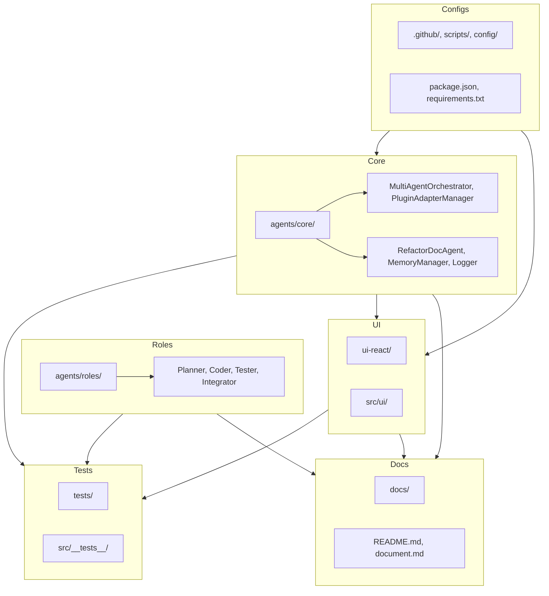

# Project Cleanup & Reorganization Plan

---

## Overview

This plan categorizes your entire project, identifies redundant or obsolete parts, and proposes a streamlined structure with clear separation of core logic, plugins, UI, tests, docs, configs, and legacy content. It leverages your well-maintained markdown files as the authoritative source of project knowledge.

---

## Categorization

| **Category**            | **Folders/Files**                                                                                     | **Purpose**                                               | **Action**                                  |
|-------------------------|-------------------------------------------------------------------------------------------------------|------------------------------------------------------------|---------------------------------------------|
| **Core Agents & Logic** | `agents/core/`, `src/core/`, `src/modules/`, `src/python/core/`                                       | Main orchestration, plugins, AI, workflows                 | Keep, modularize, document                 |
| **Roles**               | `agents/roles/`                                                                                       | Specialized agent roles                                    | Keep, document                             |
| **Tests**               | `tests/`, `src/__tests__/`                                                                           | Unit, integration, e2e tests                               | Keep, organize by module                   |
| **UI**                  | `ui-react/`, `src/ui/`                                                                               | Frontend React app, UI components                          | Keep, separate clearly                     |
| **Docs**                | `docs/`, `README.md`, `document.md`, `Immersive_Chat_Dev_Experience_Plan.md`                         | Documentation                                              | Keep, consolidate, update                  |
| **Configs & Scripts**   | `.github/`, `config/`, `scripts/`, `package.json`, `requirements.txt`, `pytest.ini`, `.eslintrc.js`  | Build, CI/CD, environment setup                            | Keep, clean unused configs                 |
| **Legacy/Experimental** | `untitled/`, `dist/`, `coverage/`, `.pycache__/`, `.venv/`                                           | Old builds, caches, temp, virtualenv                       | Archive or delete                          |
| **Unknown/Redundant**   | `local_model.py`, `model_api.py`, `redis.py`, `refactor_plan.md`                                    | Review if still needed                                     | Review, archive or delete                  |

---

## Cleanup & Consolidation Steps

- **Archive or delete**:
  - `untitled/`, `dist/`, `.pycache__/`, `.venv/`, `coverage/`
  - Old experiment files if not needed
- **Consolidate**:
  - Group all **core orchestration** under `agents/core/`
  - Group **plugin adapters** clearly
  - Group **role agents** under `agents/roles/`
  - Group **tests** by module/component
  - Group **docs** into a single `docs/` hub
- **Improve naming**:
  - Rename ambiguous files (`local_model.py`, `model_api.py`) or move to relevant modules
- **Document everything**:
  - Use this file as the central map
  - Update `README.md` with the new structure
- **Automate**:
  - Use the **RefactorDocAgent** to parse TODOs and automate doc updates
  - Add scripts to clean caches and temp files regularly

---

## Visual Architecture

---

## Next Steps

- Confirm which files/folders to archive or delete.
- Incrementally refactor modules to fit this structure.
- Keep markdown docs updated as the source of truth.
- Use the Autonomous Refactoring & Documentation Agent to automate improvements.

---

_Last updated: 2025-04-06_