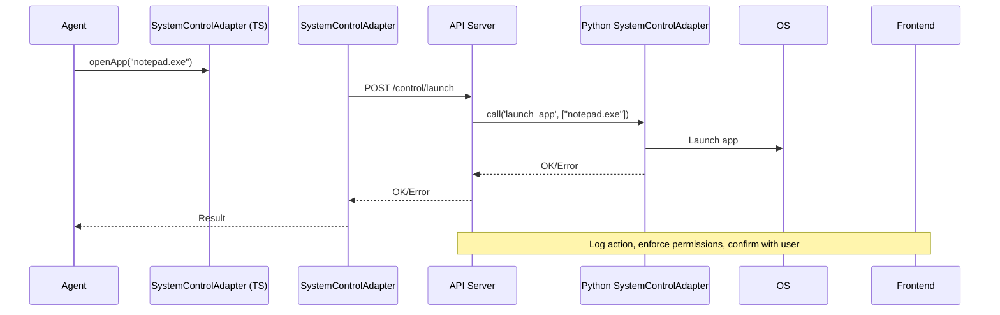

# System Control Plugin Adapter Integration Plan

## Overview

This document outlines the design and integration plan for a **System Control Plugin Adapter** that enables Digital Double agents to perform secure, modular OS-level automation tasks.

---

## Goals

- Provide agents with **human-like input simulation** (mouse, keyboard)
- Enable **GUI automation** (window management, clicks)
- Manage **system processes** (launch, terminate apps)
- Access and manipulate the **file system**
- Execute **OS-level scripts**
- Read **system state** (screen, running apps)
- Ensure **security, sandboxing, and extensibility**

---

## Architecture

### Python Backend

- **`SystemControlAdapter`** class in `agents/core/plugin_adapters.py`
- Uses libraries:
  - `pyautogui` for input and screenshots
  - `psutil` for process management
  - `subprocess` for script execution
  - `pygetwindow` for window management
- Modular functions:
  - `type_text`, `move_mouse`, `launch_app`, `close_app`
  - `run_script`, `get_active_window`, `list_processes`
  - `screenshot`, `manage_clipboard`, `file_ops`

### API Server (`src/api/server.ts`)

- New REST endpoints:
  - `/control/type`
  - `/control/mouse`
  - `/control/launch`
  - `/control/close`
  - `/control/script`
  - `/control/screenshot`
- Forwards requests to Python backend via RPC or subprocess call
- Optionally, add socket events for real-time control

### TypeScript Wrapper

- `src/modules/plugins/SystemControlAdapter.ts`
- Methods:
  - `typeText()`
  - `moveMouse()`
  - `openApp()`
  - `closeApp()`
  - `runScript()`
  - `takeScreenshot()`
- Calls REST endpoints

### Security & Sandbox

- Run backend control logic in **separate, restricted process**
- **User confirmations** before sensitive actions
- **Role-based permissions** for agents
- **Audit logs** of all actions
- **Allowlist** of permissible apps/scripts
- Future: containerize or VM-isolate control agent

---

## Testing

- **Unit tests** for Python control functions
- **Integration tests** for REST API
- **Security tests** for permission enforcement
- **End-to-end tests** simulating agent workflows

---

## Future Extensions

- OCR and computer vision for screen reading
- Audio I/O (speech, mic)
- Custom user automation scripts
- Visual targeting of UI elements

---
## Redis Integration

The System Control Plugin Adapter uses **Redis pub/sub** to enable asynchronous, decoupled communication between the API server, agents, and the Python backend.

### Architecture
- The adapter subscribes to a Redis channel (default: `system_control_channel`).
- Agents or API server publish JSON commands to this channel.
- The adapter listens, executes the requested action, and publishes the result to a response channel (`system_control_channel_response`).

### Message Format
- **Request:**
```json
{
  "command": "launch_app",
  "args": {"app_path": "notepad.exe"}
}
```
- **Response:**
```json
{
  "status": "success",
  "result": "app launched"
}
```

### Benefits
- Enables **real-time control** without blocking API calls.
- Supports **scalable, event-driven** architecture.
- Decouples API server and backend logic.

### Security
- Only trusted components should be allowed to publish control commands.
- Sensitive actions require **role-based permissions** and **user confirmation**.
- All commands and responses should be **audited**.
- Future: add message signing or encryption.

---


## Mermaid Diagram



---

## Summary

This plugin will enable **safe, modular, extensible system control** for your agents, supporting advanced automation and testing workflows.