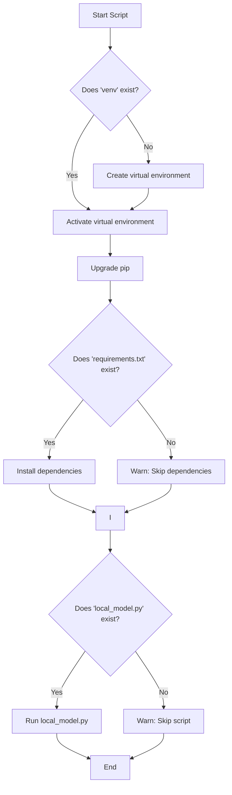

# Automated Python Environment Setup on Windows

## Overview
This document outlines the plan to replace the existing `setup_env.ps1` script with a more robust, idempotent PowerShell script that automates Python environment setup, dependency installation, and initial script execution.

---

## Objectives
- Automate virtual environment creation and activation.
- Upgrade pip inside the virtual environment.
- Install dependencies from `requirements.txt` if present.
- Run `local_model.py` if present.
- Handle missing files gracefully.
- Avoid hardcoded paths.
- Ensure the script is safe to run multiple times.

---

## New PowerShell Script (`setup_env.ps1`)

```powershell
# Define the virtual environment directory name
$venvDir = "venv"

# Check if the virtual environment already exists; if not, create it
if (-Not (Test-Path -Path $venvDir)) {
    python -m venv $venvDir
}

# Activate the virtual environment
& "$venvDir\Scripts\Activate.ps1"

# Upgrade pip to the latest version
python -m pip install --upgrade pip

# Install dependencies from requirements.txt if the file exists
if (Test-Path -Path "requirements.txt") {
    pip install -r requirements.txt
} else {
    Write-Warning "requirements.txt not found. Skipping dependency installation."
}

# Run the local model script if it exists
if (Test-Path -Path "local_model.py") {
    python local_model.py
} else {
    Write-Warning "local_model.py not found. Skipping script execution."
}
```

---

## Script Logic Flowchart



---

## Usage Instructions

1. **Set Execution Policy (if not already done):**
   ```powershell
   Set-ExecutionPolicy RemoteSigned -Scope CurrentUser
   ```

2. **Run the Script:**
   ```powershell
   .\setup_env.ps1
   ```

---

## Summary
- This script fully automates your Python environment setup.
- It is safe to run multiple times.
- It gracefully handles missing files.
- It avoids hardcoded paths and improves maintainability.