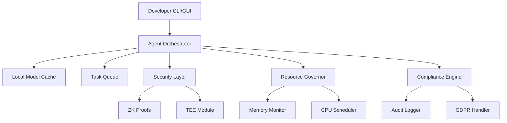

# Digital Double Virtual Workforce 3.5 - Edge-Ready, Secure, and Compliant AI Platform

---

## Overview

This document details the **edge deployment**, **security**, and **compliance** features of Digital Double Virtual Workforce 3.5, complementing the unified platform vision described in the [README](../../README.md).

---

## Core Philosophy

- **Offline-First:** Operate fully without internet connectivity.
- **Edge-Optimized:** Run on resource-constrained devices.
- **Security-First:** Protect data and operations with advanced security.
- **Compliance-Ready:** Support GDPR, audit trails, and legal hold.
- **Graceful Degradation:** Maintain functionality under adverse conditions.

---

## Key Edge-Case Mitigations

| Edge Case                     | Solution                        | Implementation                                         |
|------------------------------|--------------------------------|--------------------------------------------------------|
| Offline Operation            | Local AI + Task Queuing        | SQLite-backed priority queue, local Llama.cpp model    |
| Toolkit Failures             | Circuit Breaker Pattern        | Auto-disable flaky APIs after failures                 |
| Memory Overload              | LRU Cache + Auto-Pruning       | Per-agent memory governor                              |
| Token Budget Exceeded        | Hard Cost Caps                 | Forced task suspension                                |
| Malformed Input              | Input Sanitization Layer       | Regex-based validation                                |
| Concurrent Task Collisions   | Optimistic Locking             | CAS for shared resources                              |
| GDPR Violations              | Ephemeral Context Handling     | Auto-redaction of PII                                 |
| Latency Bottlenecks          | Adaptive Inference Scaling     | Dynamic quantization                                  |
| Privacy Risk                 | Zero-Knowledge Proofs + TEE    | Secure enclave processing                             |
| Unexpected Agent Crashes     | Hot/Cold Agent Pairs           | Instant state transfer                                |
| Audit & Compliance Failures  | Legal Blackbox                 | Tamper-proof audit trail storage                      |

---

## Architecture Highlights

---

## Features

### Offline-First Agent Core
- Local inference engine with adaptive quantization.
- Persistent task journal with CRDT-based sync.
- Air-gapped mode with full functionality.

### Bulletproof Toolkit System
- Circuit breaker and fallback strategies.
- Policy-based automation and failover.
- Auto-ML failover with predictive routing.

### Resource Governance
- Adaptive compute scaling.
- Memory and CPU monitoring.
- Storage partitioning with vector DB.

### Compliance & Security Center
- Auto-generated audit trails.
- Zero-knowledge proofs and TEE.
- Legal hold and GDPR compliance.

### Deployment & DevOps
- Edge-to-cloud sync framework.
- Kubernetes microservice orchestration.
- Automated compliance sandbox testing.

---

## How This Fits the Platform

- **Complements multi-agent orchestration** by ensuring agents remain functional and secure in edge environments.
- **Supports immersive UI and plugin adapters** with reliable, offline-capable backend.
- **Enhances self-healing** with predictive fault analytics and graceful degradation.
- **Meets enterprise compliance needs** for privacy, auditability, and legal requirements.

---

## Summary

This edge-ready, secure, and compliant architecture ensures the Digital Double Virtual Workforce 3.5 can operate autonomously, adaptively, and safely across diverse, real-world environments, fully aligned with the unified platform vision.

---
