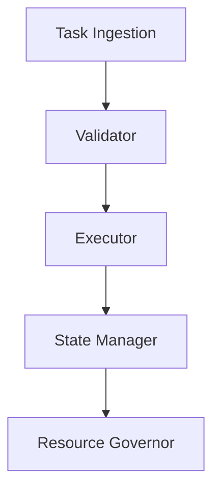

# Core Agent Module

This module implements the fundamental agent capabilities including:
- Task execution engine
- State management
- Recovery mechanisms
- Resource governance

## Architecture

The core agent uses a modular event-driven architecture:


## Usage

```typescript
import { AgentCore } from './AgentCore';

const agent = new AgentCore({
  maxMemory: '512MB',
  taskTimeout: 30000,
  recovery: { enabled: true }
});

await agent.initialize();
const result = await agent.execute(task);
```

## Implementation Details

### State Management
The AgentCore uses an event-driven architecture with built-in state isolation:

```typescript
interface StateManager {
  snapshot(): Promise<Snapshot>;
  restore(snapshot: Snapshot): Promise<void>;
  isolate(taskId: string): Promise<void>;
}
```

### Resource Governance
Memory and CPU usage are actively monitored and controlled:

```typescript
const MEMORY_LIMITS = {
  WORKER: '512MB',
  SHARED: '1GB',
  CRITICAL: '2GB'
};
```

## Testing

```bash
# Run unit tests
npm run test:core

# Run integration tests
npm run test:integration

# Run memory profiling
npm run profile:memory
```
